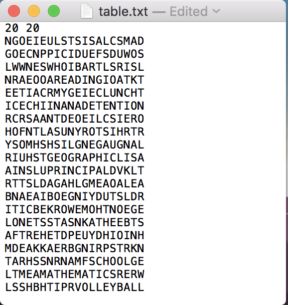

# Word Search Solver
## Why create a program that can solve word search puzzles?
The reason why i created a program that can solve word search puzzles is because I hate solving word search puzzle myself. Just putting the time and effort was a struggle for me but my girlfriend seemed to enjoy it and brought her mini word search puzzle everywhere we go and always wanted me to solve with her. Frankly, I was bad at it and an idea sparked through my mind which was you guessed it "lets build a program that can solve word search puzzles". Well that's where we're at now.

## How it works
The program is written in C++ and uses the Knuth-Morris-Pratt algorithm. It takes in two txt files, **table.txt and wordlist.txt**, which generates the **matrix grid using pointers and a vector of locations** respectively. Because the matrix grid is using dynamic memory, the program itself can run any nxn word search puzzle. The program is expected to run at worse case **O(n3)** due to the fact that it has to scan every row/column/diagonal, each word in the list, and also the KMP algorithm. The program outputs three things: the puzzle, list of words, and the location of where the words are at. The puzzle itself will come with positions in the grid starting from 0 to n - 1 on the first row and each row will have a position on the left to make looking for the words alot easier for the user. The list of words are self explanatory and the location will have 3 parts: **word, beginning and ending location, and the type**.

## How to use it
1. Find a [wordsearch](https://www.brainzilla.com/word-games/word-search/printable)
2. Count the number of columns and rows (most likely they're the same) and input those values first on the table.txt and     follow up with the word search puzzle after and make sure that the last row does not have a trailing white space.
Example:

